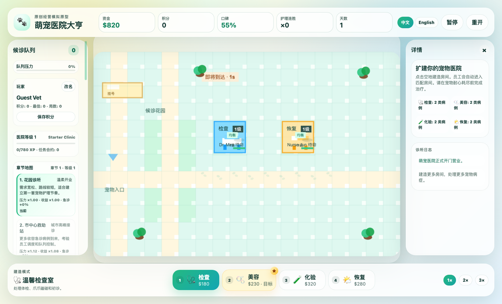
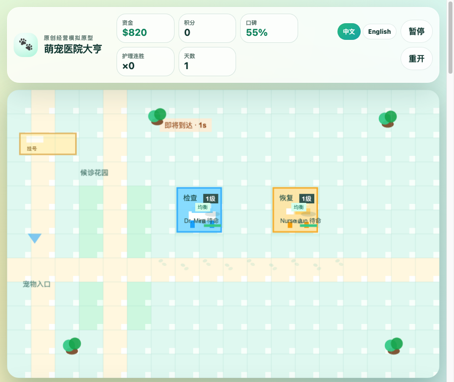
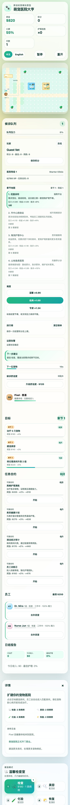

# PetCare Tycoon

PetCare Tycoon is an original bilingual pet hospital management game prototype built with Phaser, TypeScript, and Vite. It is inspired by classic management simulation games, but all gameplay naming, UI, rooms, pets, sounds, and generated pixel-art assets are original to this project.



## 中文简介

这是一个“宠物医院”主题的浏览器经营游戏原型：玩家建造诊疗室、雇佣与培养员工、安排护理流程、升级房间、处理排队宠物，并在收入、卫生、员工疲劳和宠物满意度之间做取舍。游戏界面支持中文和英文切换。

## Highlights

- Bilingual UI: Chinese and English switching from the top bar.
- Management loop: build rooms, hire staff, assign work, treat pets, earn cash, and expand capacity.
- Local player profile, score saving, and leaderboard tracking through browser storage.
- Difficulty modes: Cozy, Classic, and Expert adjust starting money, arrivals, patience, upkeep, pressure, and score multipliers.
- Chapter maps: unlock Garden Clinic, Downtown Rescue, Beachside Spa, and Mountain Emergency layouts with escalating pressure, urgency, upkeep, and rewards.
- Hospital level progression adds XP, level-up rewards, and longer-term clinic growth milestones.
- Optional mission contracts add side objectives such as rush care, VIP wellness, clean-shift audits, and staff training days.
- Room systems: exam, treatment, pharmacy, and grooming rooms with upgrades to level 3.
- Staff progression: staff gain XP, level up, earn skill points, and unlock useful care skills.
- Live simulation: pet arrivals, queues, cleanliness, fatigue, warnings, daily reports, and economy pressure.
- Responsive HUD: desktop, tablet, and mobile layouts with scrollable side panels.
- Original presentation: checked-in pixel-art assets, WebAudio effects, particles, and Phaser rendering.
- Automated verification: real-click, responsive, long-run, stress, visual, and performance checks.

## Screenshots

| Desktop | Tablet | Mobile |
| --- | --- | --- |
|  |  |  |

## Tech Stack

- [Phaser](https://phaser.io/) for the game scene and rendering.
- [TypeScript](https://www.typescriptlang.org/) for game, UI, and simulation code.
- [Vite](https://vite.dev/) for local development and production builds.
- DOM overlay HUD for management panels, inspector controls, and bilingual text.

## Requirements

- Node.js 20.19 or newer is recommended because Vite 8 requires `^20.19.0 || >=22.12.0`.
- npm is used because this repository includes `package-lock.json`.

## Quick Start

```bash
npm install
npm run dev
```

Open the local URL printed by Vite, usually:

```text
http://localhost:5173/
```

## Build

```bash
npm run build
```

Build output is generated in `dist/`. The folder is intentionally ignored by Git because it can be recreated from source.

## Preview Production Build

```bash
npm run preview
```

## Game Controls

- Click an empty tile to build the selected room.
- Click a room to inspect details, assign staff, upgrade rooms, and spend skill points.
- Use the left staff panel to hire or select employees.
- Use the bottom build bar to switch room type.
- Press `Space` to pause or resume.
- Press `1`, `2`, `3`, `4` to choose room types.
- Use `中文` / `English` in the top bar to switch language.
- Use the left player card to rename the local profile, save the current score, and manage the local leaderboard.
- Choose Cozy, Classic, or Expert difficulty from the left panel; changing difficulty starts a fresh run with new pressure and scoring rules.
- Use the Chapter Map card to enter unlocked maps; each map starts a fresh branch run with a different layout and higher challenge multipliers.
- Start mission contracts from the left panel to chase extra cash, reputation, hospital XP, and score rewards.
- Restart from the HUD when you want to begin a fresh run.

## Gameplay Guide

A more complete player guide is available here:

- [`docs/GAME_GUIDE.md`](docs/GAME_GUIDE.md)

## Verification

Run the full release gate before publishing gameplay or UI changes:

```bash
npm run test:all
```

Individual checks are also available:

```bash
npm run build
npm run test:actions
npm run test:clicks
npm run test:responsive
npm run test:long-run
npm run test:stress
npm run test:visual
npm run test:performance
```

What the checks cover:

- `test:actions` audits HUD `data-action` handlers against real-click coverage.
- `test:clicks` runs real Chrome click flows for room building, room inspection, staff assignment, player rename, difficulty selection, chapter map selection, contract start/completion, score saving, leaderboard clearing, pause, restart, and upgrades.
- `test:responsive` verifies mobile and tablet layouts, scrolling, overflow, and key controls.
- `test:long-run` advances multiple in-game days and checks reports and economy behavior.
- `test:stress` validates debt, dirty rooms, lost pets, tired staff, and warning states.
- `test:visual` captures desktop, mobile, tablet, long-run, and stress screenshots into `screenshots/`.
- `test:performance` samples browser frame pacing and fails on unexpected console or page errors.

## Project Structure

```text
pet-hospital-game/
├── docs/                  # Player guide and design documentation
├── public/assets/          # Checked-in original PNG pixel assets
├── screenshots/            # Verification and README screenshots
├── scripts/                # Browser-based verification scripts
├── src/game/simulation/    # Source of truth for rules and saveable state
├── src/i18n/               # Chinese and English text resources
├── src/phaser/assets/      # Runtime/generated game textures
├── src/phaser/scenes/      # Phaser scene orchestration and rendering adapter
├── src/ui/                 # DOM HUD and shell UI
├── index.html              # Vite entry HTML
├── package.json            # npm scripts and dependencies
└── vite.config.ts          # Vite configuration
```

## GitHub Packaging Notes

This repository is ready to publish as source code. Generated or local-only folders are excluded by `.gitignore`:

- `node_modules/`
- `dist/`
- `.env` and `.env.*`
- local logs, caches, coverage, and test reports

Recommended local publish flow:

```bash
git init
git add .
git commit -m "Initial PetCare Tycoon release"
git branch -M main
git remote add origin git@github.com:github/ghoulvspol.git
git push -u origin main
```

If your GitHub owner is not literally `github`, replace `github/ghoulvspol` with your actual `owner/repository` path before adding the remote.

## Asset and IP Notice

This project does not include copied game assets, copyrighted characters, original names, sounds, or rooms from other games. The implementation is an original pet-hospital-themed management prototype.

## License

No open-source license has been declared yet. Add a `LICENSE` file before inviting external reuse or contributions.
